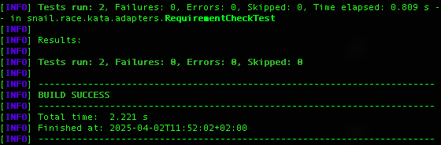

🐌 Snail Race Kata - snail race bet (java)
====
=

The goal of this kata is to practice hexagonal architecture and adapter contract testing by
writing a bet application.

# Requirement setup

1. Start mongodb locally

```shell
docker run --rm -p 27017:27017 --name mongo_contract_testing -d mongo
```

2. Start the snail race server locally

Run the docker hub image
```shell
docker run --rm -d -p8000:8000 --name snail-race-server mathieucans/snail-race-server:latest
```

Verify the race server status
```shell
curl localhost:8000/results
```

3. Install dependencies and check requirements by run the following command
```shell
./mvnw test -Dtest=RequirementCheckTest
```
If all tests are green 🟢, you are ready to run the workshop 🏆!

Follow the [kata instructions](../Instructions.md)