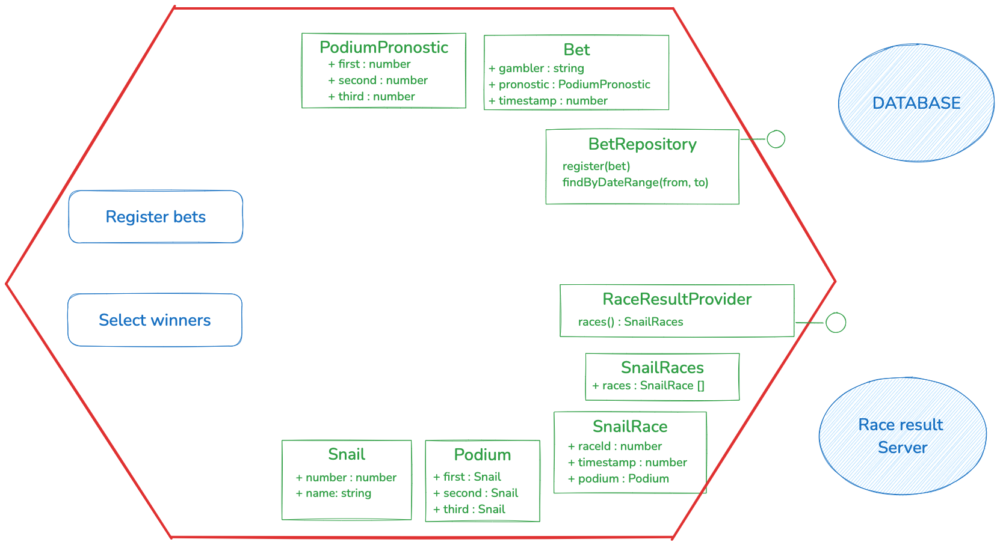

🐌 Snail Race Kata - snail race bet (java)
=====

The goal of this kata is to practice hexagonal architecture and adapter contract testing by
writing a bet application.

# Requirement setup

1. Start mongodb locally

```shell
    docker run --rm -p 27017:27017 --name mongo_contract_testing -d mongo
```

2. Start the snail race server locally

Run the docker hub image
```shell
   docker run --rm -d -p8000:8000 --name snail-race-server mathieucans/snail-race-server:latest
```

Verify the race server status
```shell
   curl localhost:8000/results
```

3. Install dependencies
   ```shell
   ./mvnw install
   ```
4. Check that requirements by run the following command
   TODO : create a command for that


5. Run test through your IDE or with the following command
    ```shell
    nvm test
    ``` 
# Domain elements

The application is about bet on snail races 🐌🏁.

The application can register bet and determine winners.
The application has two external dependencies :
- a repository where store and retrieves bets
- a race result provider

# Instructions

## Step 1: Contract test a read/write dependency

1. contract test a database
    1. Implement MongoDbBetRepository to pass it tests
    2. Create a InMemoryBetRepository that implement the BetRepository.
2. use contract test to write in memory adapter
    1. Execute the same test for both MongoDbBetRepository and InMemoryBetRepository
    2. Implement the InMemoryBetRepository to pass it tests

## Step 2: Contract test a readonly dependency
1. Use test to implement the RaceResultProvider interface based on the real server
2. Use the same tests to implement a FakeRaceResultProvider that have same behaviour

## Step 3: Use simulators to write application test following the business rules

You can checkout the branch `start-step3` if needed

### Business needs to implement
1. The application can register bet
    * registering a bet is done by providing
        * gambler name
        * [snail1, snail2, snail3] where snail1 is the number of snail expected to win, snail2 is the second and snail3 is the third
2. The application lists the winners according to last race ran. To win a bet :
    1. The podium match exactly the race result
    2. The bet has been registered at least 3 seconds before the race timestamp
    3. A bet is valid only for the next race

# Application diagram


