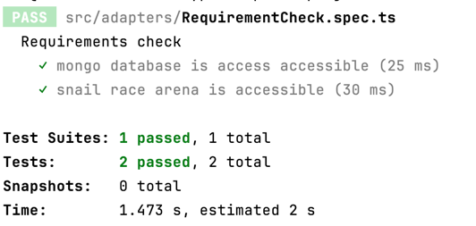
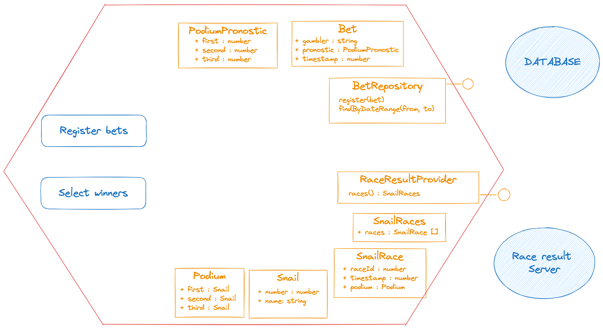

🐌 Snail Race Kata - snail race bet (typescript)
=====

The goal of this kata is to practice hexagonal architecture and adapter contract testing by
writing a bet application.

# Requirement setup

1. Start mongodb locally

```shell
    docker run --rm -p 27017:27017 --name mongo_contract_testing -d mongo
```

2. Start the snail race server locally

Run the docker hub image 
```shell
   docker run --rm -d -p8000:8000 --name snail-race-server mathieucans/snail-race-server:latest
```

Verify the race server status
```shell
   curl localhost:8000/results
```

3. Install dependencies
   ```shell
   npm install
   ```
4. Check that requirements by run the following command
    ```shell
    npm run check-requirements
    ``` 



5. Run test through your IDE or with the following command
    ```shell
    npm run test
    ``` 
# Domain elements

The application is about bet on snail races 🐌🏁.

The application can register bet and determine winners.
The application has two external dependencies : 
   - a repository where store and retrieves bets
   - a snail race arena that provide races results

# Instructions

1. Contract test a read/write dependency

   1. contract test a database
      1. Implement MongoDbBetRepository to pass it tests
      2. Create a InMemoryBetRepository that implement the BetRepository.
   2. use contract test to write in memory adapter
      1. Execute the same test for both MongoDbBetRepository and InMemoryBetRepository
      2. Implement the InMemoryBetRepository to pass it tests 

2. Contract test a readonly dependency
   1. Use test to implement the SnailRacesArena interface based on the real server
   2. Use the same tests to implement a FakeSnailRacesArena that have same behaviour

3. Use simulators to write application test following the business rules (you can checkout the branch `start-step3` if needed)
   1. The application can register bet
      * registering a bet is done by providing
         * gambler name
         * [snail1, snail2, snail3] where snail1 is the number of snail expected to win, snail2 is the second and snail3 is the third
   2. The application lists the winners according to last race ran. To win a bet :
      1. The podium match exactly the race result
      2. The bet has been registered at least 3 seconds before the race timestamp
      3. A bet is valid only for the next race
   3. Advice on how to concieve the tests:
      1. Create some object/class (TestableApplication), taking all the adapters for instantiation. that has the following api
      2. The Api of this class or object should be something like
          * registerBet()
          * simulateRaceResult() // this is the only test specific method
          * getWinners()
      3. This object should delegate as much as possible to non test specific code, for instance it could create and call usecases or services
      4. Make the tests use this object as it's *System Under Test* (SUT)

# Application diagram



# TODO
 - Expliquer le domaine avant l'exercice
 - Attention aux flèches des dépendances dans les slides
 - Renommer les squelettes de tests dans MongoDbBetRepository.spec.ts : exdample ne retourne pas les bet out dated
 - Attention, ce n'est pas visible que le repository est créé dans MongoDbBetRepository.spec.ts
 - Interessant, ce n'est pas acquis pour tout le monde que l'effet de bord d'un write est le read
 - C'est cool de parler des différentes façons de tester les read write
   - mocks
   - database
     - avec l'interface
     - en utilisant l'infra
 - TDD : on a pas besoin de faire la première impementation :  ce n'est pas naturel pour tous le monde
 - EN fait c'est long de faire juste le test BDD on a pas mal de choses à partager
   - stratégies
   - anti corruption id
   - pb du typage 
   - Ce serait mieux d'avoir deux parties, car il faut apréhender la partie abstract test class pour supprimer la duplication
 - Nettoyer la base en after each
 - Timing : > 1h pour juste mongo db
 - Sur la partie 1.2
   - Tester les limites ?
   - Le pas pour abstract test class et fonctions n'est pas facile pour tous le monde 
 - Penser à faire des tags pour chaque fin d'exercice pour que les personnes puissent continuer si elles n'ont pas fini
 - En remote prévoir une heure la veille pour le setup des PC
 - REssenti des participants : c'est gros je ne suis pas sur que ca rentre en une journée

 - Partie 2 :
   - Bien expliquer ce qu'on va faire.
   - On a pas parlé des mock mais ce qu'il faillait faire 
     - On a dut refaire un schméa sur ce qu'est le domaine (schéma existant)
     - Et détailler ce que veut dire la démarche sur contract test d'un provider readonly
   - En gros il faut à chaque fois revenir sur le domaine et le problème que l'on veut résoudre
   - Le fait d'avoir imposé le design adapter, rends difficile l'apprentissage. 
     - On a moins la possibilité de faire capture de ce qui est attendu et de copier coller dans le test
   - Une suggestion d'amélioration : fetch n'est pas claire pour tout le monde il faut peut être des antisèche
   - Les copains on galérer à apprendre l'API à partir des tests
     - Ils ont eu du mal a voir les différences entre le contrat du domaine et ce que donne le serveur réellement
   - Il a fallut une démo pour montrer comment ca pourrait être : 
     - utilisation des tests  + copy paste du retour de la fonction pour apprendre l'API seerveur
     - le fait que les tests sont rouges au bout de 5 minute
     - qu'il faut isoler la partie anti-corruption du test de contrat pour avoir le temps de l'implémenter